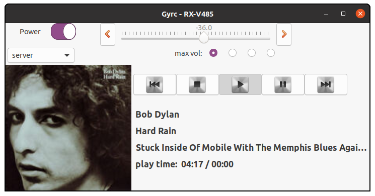

GTK+ graphical interface for controlling and streaming to Yamaha network receivers using pymusiccast

above: 2020-07-07 still heavy development
Please note that Gyrc is for controlling your Yamaha receiver like a remote control.  It
is not a media-surfer or chooser.

under development
