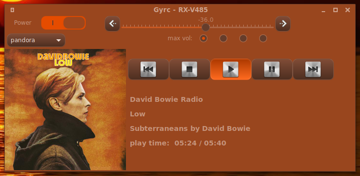
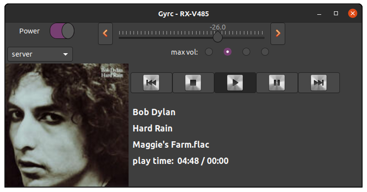
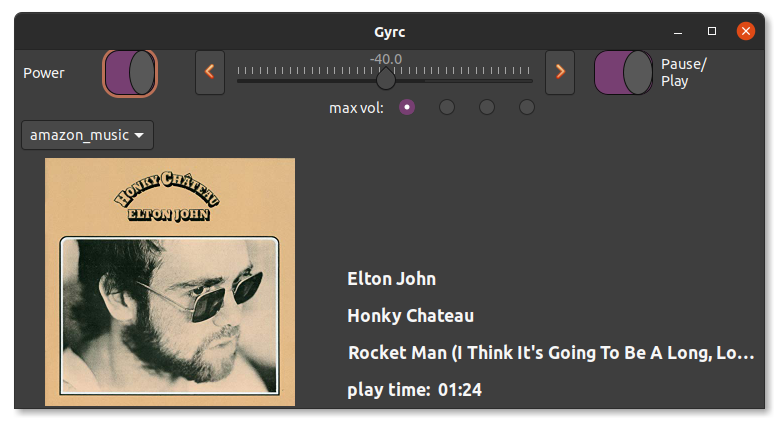

GTK+ graphical interface for controlling and streaming to Yamaha network receivers using pymusiccast

2020-07-14 taking shape

Gyrc on a new Debian 10 installation with themed Cinnamon desktop.

All buttons now work depending on the which source is playing.

Soon to require the development branch of pymusiccast on GitHub.

above: 2020-07-07 still heavy development

Please note that Gyrc is for controlling your Yamaha receiver like a remote control.
It is not a media-browser or chooser.

under development
