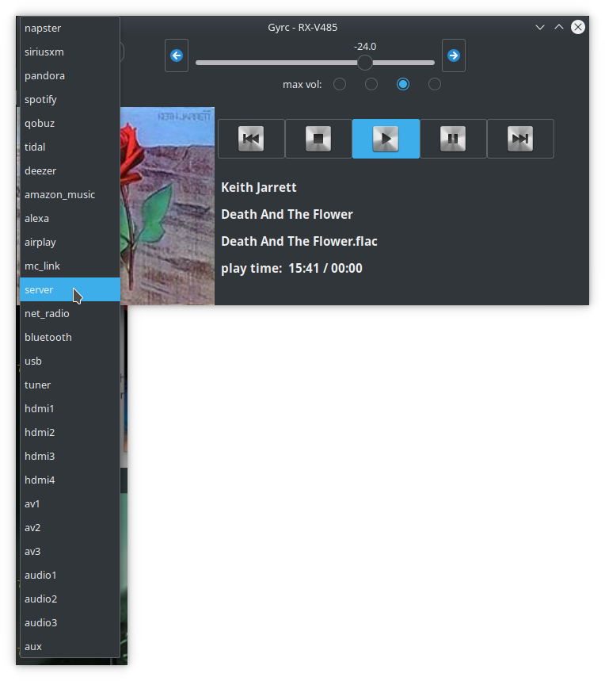

#### Gyrc

#### GNOME AV Receiver Control

GTK+ graphical interface for controlling and streaming to Yamaha® network receivers using pymusiccast

Gyrc is a 3rd party open-source app to assist users in the remote control of Yamaha AV receivers.  It
is not affiliated in any way with that or any other company.

"Yamaha" is a registered trademark of Yamaha Corporation.

shot of the app showing the dropdown list for receiver sources

above: 2020-07-07 still heavy development

Please note that Gyrc is for controlling your Yamaha receiver like a remote control.
It is not a media-browser or chooser.
